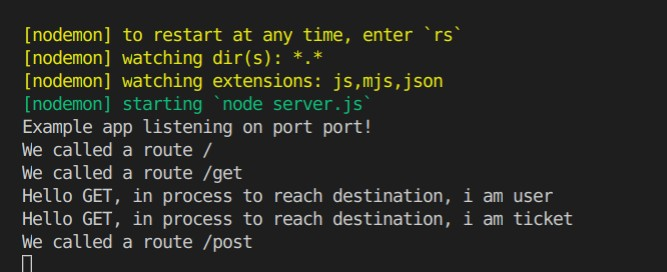

###### MIDDLEWARE CHAINNING

<br>

```javascript
//----------------  MIDDLEWARE * GENERIC  --------
//
app.use((req, res, next) => {
  console.log(`We called a route ${req.url}`);
  next();
});
//_______________________________________________
//_______________________________________________
//
//

//----------------  ROUTE  *  SPECIFIC --------
//
const getMiddleWareUser = (req, res, next) => {
  //1 this one is going to be checked first
  console.log(`Hello GET, in process to reach destination, i am user`);
  next(); //if all is fine  next() will allow me to check the ticket
};

const getMiddleWareTicket = (req, res, next) => {
  //2 this one is going to be checked second
  console.log(`Hello GET, in process to reach destination, i am ticket`);
  next(); //if all is fine  next() will allow me to reach destination and watch the movie
};

// ************** several middlewares
// this one is going to be checked last but the two middlewares have to correspond to each function above.

app.get("/get", getMiddleWareUser, getMiddleWareTicket, (req, res) => {
  res.json({
    //3
    message: "I reached the destination, i can watch the movie now",
  });
});
/* 


app.get("/get", getMiddleWareUser, getMiddleWareTicket, (req, res) => {  
  in this line you can add as many middleware you want.


*/
// ------------------

app.post("/post", (req, res) => {
  res.json({
    message: "Hello World! POST",
  });
});
```

  <br>
    <br>

<br>

#### TO SEE THE RESULT of this

- 1\_ Type the following in the browser: http://localhost:5000/

<p>By doing this you will see in the VS console that a message like this will be shown: "we called a route" , this represents the GENERIC MIDDLEWARE</p>

  <br>

- 2\_ Type the following in the browser: http://localhost:5000/get

- 3\_ type the following in the RESTED in post method: http://localhost:5000/post

<br>
<br>



<br>
<br>

##### In the next example you will see how to add several middlewares in one line.

<hr>
<br>
<br>

https://expressjs.com/en/guide/writing-middleware.html - source!
[Express](https://expressjs.com/en/guide/writing-middleware.html)


  <br>
<br>
<br>
<br>

##### 1)\_\_ INSTALL DEPENDENCIES

```javascript
//install :
npm i express
npm i nodemon
/*


 Dont forget to add this "nodemon" otherwise when you will type nodemon server.js , it will
send an error and you will have to kill the server process if you already typed the npm start and start
all over again.

*/

```

<br>
<br>

##### 2)\_\_ snippets | basic template to start the app

```javascript
/*

the SNIPPET : e4-example-Hello
                                            Will give you all this:
*/

const express = require('express');
const app = express();

app.get('/', (req, res) => {
    res.send('Hello World!');
});

app.listen(port, () => {
    console.log('Example app listening on port port!');
});

//Run app, then load http://localhost:port in a browser to see the output.
------------


```
