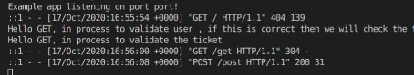

### MIDDLEWARE MORGAN


###### Morgan — HTTP logging middleware for express. It provides the ability to log incoming requests by specifying the formatting of log instance based on different request related information. For example:

[MORE INFO](https://itnext.io/setup-logger-for-node-express-app-9ef4e8f73dac)

```javascript
:method
:url
:status
:response-time ms -
:res[content-length]
```

<br>

<p>In this example you can see that I hided the GENERIC MIDDLEWARE,
and that is because this line is going to do the same job  but better:
<br>
</p>

```javascript
app.use(morgan("dev"));
```

<br>

```javascript
//
//
//----------------  MIDDLEWARE * GENERIC  --------
// WHEN YOU ARE GOING TO START USING MORGAN you hide the generic
// //
// app.use((req, res, next) => {
//   console.log(`We called a route ${req.url}`);
//   next();
// });
//_______________________________________________
//_______________________________________________
//
//
//The request body should only be parsed as JSON if the Content-Type header begins with application/json. Since we want to do this for every request, the easiest solution is to use an application before middleware.

app.use(express.json()); //JSON body parser middleware
//
//
app.use(morgan("dev")); //setup morgan request logger middleware
// https://www.npmjs.com/package/morgan

//----------------  ROUTE  *  SPECIFIC --------
//
const getMiddleWareUser = (req, res, next) => {
  //1
  console.log(
    `Hello GET, in process to validate user , if this is correct then we will check the ticket`
  );

  next(); //if all is fine  next() will allow me to check the ticket
};

const getMiddleWareTicket = (req, res, next) => {
  //2
  console.log(`Hello GET, in process to validate the ticket`);
  // error handling, you have to hide the next() to see the error message.
  // res.json({
  //   error: "Your ticket is not valid", //if this show under an statement the user will not be able go to the next step
  // });
  next();
  //if all is fine  next() will allow me to reach destination and watch the movie
};

// ***********************************************

app.get("/get", getMiddleWareUser, getMiddleWareTicket, (req, res) => {
  res.json({
    //3
    message: "I reached the destination, i can watch the movie now",
  });
});
// app.get("/get", getMiddleWareUser, getMiddleWareTicket, (req, res) => {  in this line you can add as many middlewares you want
// ------------------

app.post("/post", (req, res) => {
  res.json({
    message: "Hello World! POST",
  });
});
```

  <br>

#### But what is DEV ?

```javascript
app.use(morgan("dev")); //setup morgan request logger middleware
```

<p>dev:
Concise output colored by response status for development use. The :status token will be colored green for success codes, red for server error codes, yellow for client error codes, cyan for redirection codes, and uncolored for information codes.</p>

<br>


<p>the meaning for that is:</p>

```javascript
:method  // GET POST etc ...
:url      // /get , /post like so : http://localhost:5000/get
:status   // HTTP response status codes indicate whether a specific HTTP request has been successfully completed or not
:response-time ms - //0.708 ms , it s not good if a request takes more than a second, and that is because if 1000 people make a request that take 1 seconds each one, it will make our IP very slow or block it completely(see the ddos attack on server)
:res[content-length]
//HTTP Content-Length entity-header is used to indicate the size of entity-body in decimal no of octets i.e. bytes and sent it to the recipient. It is a forbidden header name. Basically it is the number of bytes of data in the body of the request or response. The body comes after the blank line below the headers.
// https://www.geeksforgeeks.org/http-headers-content-length/

:res[header]
//The given header of the response. If the header is not present, the value will be displayed as "-" in the log.
//
:req[header]
//The given header of the request. If the header is not present, the value will be displayed as "-" in the log.

//MORE: https://www.npmjs.com/package/morgan
```

### But what about COMMON which is another option for DEV

```javascript
app.use(morgan("common")); //setup morgan request logger middleware
```

<br>

#### example for COMMON ?

<br>



<br>
<br>

#### TO SEE THE RESULT of this

- 1\_ Type the following in the browser: http://localhost:5000/

<p>By doing this you will see in the VS console that a message like this will be shown:</p>

###### result

```javascript
::1 - - [17/Oct/2020:16:55:54 +0000] "GET / HTTP/1.1" 404 139
```

  <br>
<br>

- 2\_ Type the following in the browser: http://localhost:5000/get

###### result

```javascript
Hello GET, in process to validate user , if this is correct then we will check the ticket

Hello GET, in process to validate the ticket

::1 - - [17/Oct/2020:16:56:00 +0000] "GET /get HTTP/1.1" 304 -
```

<br>
<br>

- 3\_ type the following in the RESTED in post method: http://localhost:5000/post

###### result

```javascript
::1 - - [17/Oct/2020:16:56:08 +0000] "POST /post HTTP/1.1" 200 31
```

<br>
<br>

## HTTP response status codes

<p>HTTP response status codes indicate whether a specific HTTP request has been successfully completed. Responses are grouped in five classes:</p>

- Informational responses (100–199),
- Successful responses (200–299),
- Redirects (300–399),
- Client errors (400–499),
- and Server errors (500–599).

<br>
<br>

[MORE INFO](https://developer.mozilla.org/en-US/docs/Web/HTTP/Status)

<br>
<br>
<hr>
<br>
<br>

##### 1)\_\_ INSTALL DEPENDENCIES

```javascript
//install :
npm i express
npm i nodemon
npm i morgan
/*


 Dont forget to add this "nodemon" otherwise when you will type nodemon server.js , it will
send an error and you will have to kill the server process if you already typed the npm start and start
all over again.

*/

```

<br>
<br>

##### 2)\_\_ snippets | basic template to start the app

```javascript
/*

the SNIPPET : e4-example-Hello
                                            Will give you all this:
*/

const express = require('express');
const app = express();

app.get('/', (req, res) => {
    res.send('Hello World!');
});

app.listen(port, () => {
    console.log('Example app listening on port port!');
});

//Run app, then load http://localhost:port in a browser to see the output.
------------


```
