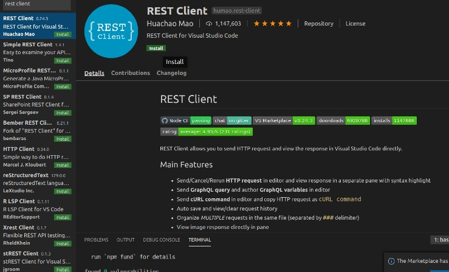
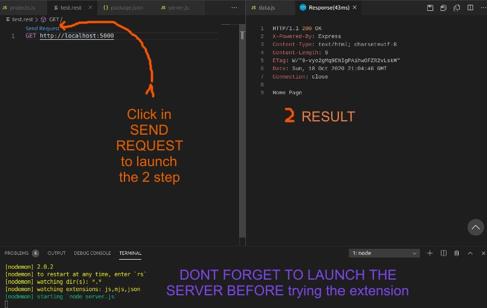

#### MANAGE USER ROLES

<br>

##### 1)\_\_ INSTALL THE DEPENDENCIES

```javascript
//install :
npm i express
npm i nodemon
npm i morgan
/*


 Dont forget to add this "nodemon" otherwise when you will type nodemon server.js , it will
send an error and you will have to kill the server process if you already typed the npm start and start
all over again.

*/

```

<br>
<br>

##### 2)\_\_ snippets | basic template to start the app

```javascript
/*

TYPE the following SNIPPET : e4-example-Hello
                                            Will give you all this:
*/

const express = require('express');
const app = express();

app.get('/', (req, res) => {
    res.send('Hello World!');
});

app.listen(port, () => {
    console.log('Example app listening on port port!');
});

//Run app, then load http://localhost:port in a browser to see the output.
------------


```

<br>
<br>

#### 3) Install the REST CLIENT EXTENSION

<p>It s the RESTED app that we use in the browser to generate and visualize the POST GET etc request </p>

<br>



<p>RESULT </p>



<br>
<br>
<hr>
<br>
<br>
